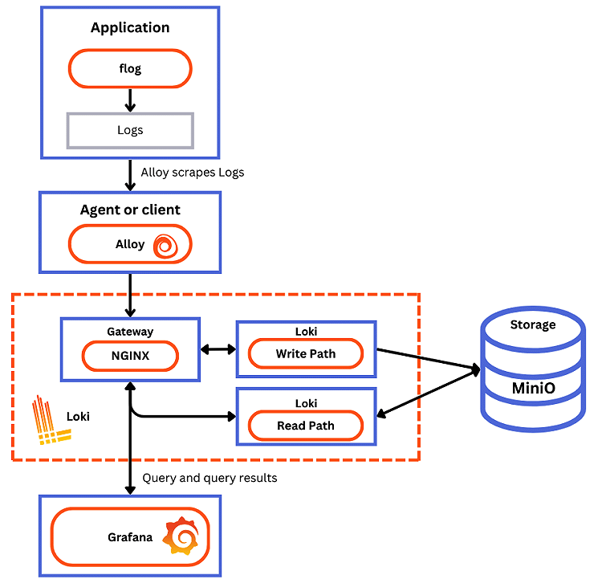

The Docker Compose configuration runs the following components, each in its own container:

- `flog`: which generates log lines. flog is a log generator for common log formats.
- `Grafana Alloy`: which scrapes the log lines from flog, and pushes them to Loki through the gateway.
- `Gateway (nginx)`: which receives requests and redirects them to the appropriate container based on the request’s URL.
- `Loki read component`: which runs a `Query Frontend` and a `Querier`.
- `Loki write component`: which runs a `Distributor` and an `Ingester`.
- `Loki backend component`: which runs an Index Gateway, Compactor, Ruler, Bloom Planner (experimental), Bloom Builder (experimental), and Bloom Gateway (experimental).
- `Minio`: which Loki uses to store its index and chunks.
- `Grafana`: which provides visualization of the log lines captured within Loki.

